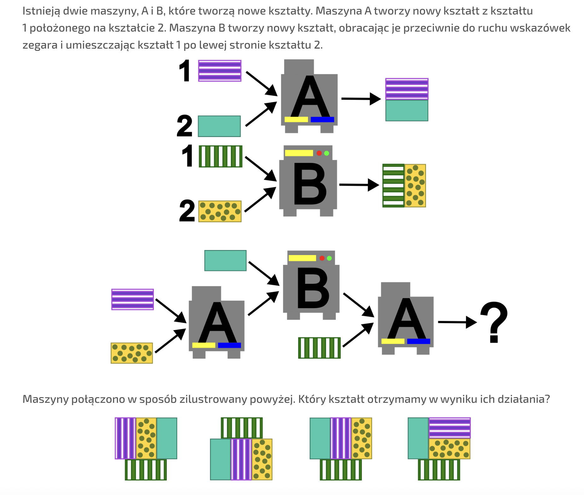

# Algorytmy od kuchni i nie tylko. Podstawowe pojęcia: algorytm i jego specyfikacja.

## Wymagana wiedza

Podstawy języka Python (wczytywanie, wypisywanie, zmienne)

## Treści z podstawy programowej

| Dział      | Sekcja                          |
| ----------- | ------------------------------------ |
| I. Rozumienie, analizowanie i rozwiązywanie problemów. Uczeń:      |  |
|       | 1) Formułuje problem w postaci specyfikacji (czyli opisuje dane i wyniki) i wyróżnia kroki w algorytmicznym rozwiązywaniu problemów. |
| II. Programowanie i rozwiązywanie problemów z wykorzystaniem komputera i innych urządzeń cyfrowych. Uczeń:       |  |
| | 1) W programach stosuje: **instrukcje wejścia/wyjścia, wyrażenia arytmetyczne** i logiczne, instrukcje warunkowe, instrukcje iteracyjne, funkcje oraz zmienne i tablice. |

## Wstęp teoretyczny (przewidziany na około 15 minut)

W tej lekcji skupimy się na przekazaniu intuicyjnego rozumienia algorytmu i specyfikacji problemu.

### Zadanie wprowadzające (4 minuty)


Uszereguj następujące kroki w kolejności tak, by otrzymać przepis na pizzę.

* Dodaj składniki: Przełóż uformowane ciasto na blachę i dodaj wybrane składniki.
* Odstaw do wyrośnięcia: Przykryj ciasto ściereczką i zostaw w ciepłym miejscu na 1 godzinę, aż podwoi objętość.
* Uformuj pizzę: Na oprószonym mąką blacie rozwałkuj ciasto na cienki placek.
* Zrób zaczyn: W miseczce wymieszaj ciepłą wodę, drożdże i cukier. Odstaw na 5-10 minut, aż zacznie się pienić.
* Podawaj: Po wyjęciu z piekarnika możesz dodać świeżą rukolę lub oliwę. Smacznego! 😋
* Piecz pizzę: Wstaw do gorącego piekarnika i piecz przez 7-10 minut, aż brzegi będą złociste, a ser się roztopi.
* Wyrób ciasto: Do dużej miski wsyp mąkę, dodaj sól, oliwę i zaczyn. Wyrabiaj ciasto ok. 10 minut, aż będzie elastyczne.

**Wnioski**: Utworzony przepis jest niczym innym, jak listą kroków działania (można nazwać go również algorytmem).
Aby wykonać kolejny krok, poprzednie muszą zostać zakończone (np. nie mogę dodać składników na placek, jeśli nie mam jeszcze wyrobionego ciasta).

### Specyfikacja problemu (3 minuty)

Problem algorytmiczny można opisać za pomocą dwóch elementów: danych wejściowych i oczekiwanego wyniku.
Dla przykładu, w poprzednim zadaniu problem "Jak ugotować pizzę" można opisać za pomocą danych
(składniki takie jak drożdże, mąka, woda, ser) oraz oczekiwanego wyniku (jadalna pizza). 
Rolą człowieka jest zazwyczaj opracowanie rozwiązania, na przykład za pomocą listy kroków, co zrobiliśmy przed chwilą.

### Zadanie utrwalające pojęcia związane ze specyfikacją (8 minut)

Opisz dane wejściowe oraz wyniki. Propozycje problemów:

* Jak stworzyć żurawia z origami?
* Jak przygotować kanapkę?
* Jak ubrać się na jazdę na nartach?
* (**Chemia**) Jak przygotować "słoniową pastę do zębów"?
* (**Język Polski**) Jak napisać charakterystykę?
* (**Wychowanie fizyczne**) Jak ćwiczyć rozciąganie? Podpowiedź: wynikiem rozwiązania jest poprawienie stopnia rozciągnięcia mięśni.

**Wnioski**: Specyfikacja problemu pozwala nam lepiej zrozumieć nasze "dostępne środki" oraz "cel", który chcemy osiągnąć.
Bez nich nie będziemy w stanie opracować kroków, które rozwiążą problem.

## Zadania do rozwiązania w trakcie lekcji na kartkach (przewidziane na około 10-15 minut)

Propozycje typów zadań, które utrwalą w uczniach myślenie komputacyjne (specyfikacja + lista kroków).

Typy zadań:

* Dla danego określonego zachowania (listy kroków lub wizualizacji działania algorytmu), określ wynik dla podanych danych.
    * Fabryka kształtów
    * Robot Aneta
* Dla danej specyfikacji (dane wejściowe, wynik), odgadnij listę kroków.
    * Ukryta zasada
    * Opracuj kroki

### Fabryka kształtów (XIX konkurs Bóbr)



### Robot Aneta

Robot Aneta, gdy usłyszy liczbę całkowitą,
oblicza trzykrotność tej liczby a następnie wygłasza ten wynik pomniejszony o 13.
Robot Beata, gdy słyszy liczbę całkowitą, oblicza jej połowę (dla liczb nieparzystych zaokrągli w dół) i wygłasza
obliczony wynik.
Robot Beata stoi obok Anety i usłyszy wypowiedziany przez nią wynik.

Jaką liczbę podasz robotowi Anecie, żeby Beata powiedziała na koniec taką samą liczbę, którą podałeś/podałaś?

### Ukryta zasada

Jaka będzie kolejna liczba w ciągu?

* 1, 2, 3, 4, 5, 6, ?
* 1, 1, 2, 3, 5, 8, ?
* 1, 2, 4, 8, 16, 32, ?
* 1, 4, 13, 40, 121, ?

### Opracuj kroki

Dla wybranego problemu (np. z listy z zadania o specyfikacji) opracuj kolejne kroki, które pozwolą osiągnąć
wynik.

## Zadanie do rozwiązania na komputerze (przewidziane na około 15 minut)

Janek interesuje się liczbami, chciałby poznać różne informacje dla wybranej przez siebie liczby.

Napisz program w języku Python, który po wczytaniu liczby całkowitej za pomocą polecenia `input()` wypisze
następujące informacje:

* Wczytana liczba (rozwiązanie: `x`)
* Liczba przeciwna (rozwiązanie: `-x`)
* Liczba odwrotna (rozwiązanie: `1/x`)
* Dwukrotność (rozwiązanie: `2*x`)
* Połowa (rozwiązanie: `x/2`)
* Kwadrat liczby (rozwiązanie: `x*x`)

Przykładowo, dla `5`, program powinien wypisać

```
Wczytana: 5
Przeciwna: -5
Odwrotna: 0.2
Dwukrotność: 10
Połowa: 2.5
Kwadrat: 25
```

Rozwiązanie wzorcowe

```python
x = int(input())
print("Wczytana ", x)
print("Przeciwna ", -x)
print("Odwrotna ", 1/x)
print("Dwukrotność ", 2*x)
print("Połowa ", x/2)
print("Kwadrat ", x*x)
```

Dodatkowe propozycje zadań:

### Od tyłu

Napisz program w języku Python, który po wczytaniu trzech liczb całkowitych wypisze je w odwrotnej kolejności.
Przykładowo, dla `1 2 3` program powinien wypisać `3 2 1`.

Rozwiązanie wzorcowe 

```python
a = int(input())
b = int(input())
c = int(input())
print(c)
print(b)
print(a)
```

### Suma i różnica

Napisz program w języku Python, który po wczytaniu dwóch liczb całkowitych wypisze ich sumę i różnicę
Przykładowo, dla `6 2` program powinien wypisać `8 4`.

Rozwiązanie wzorcowe 

```python
a = int(input())
b = int(input())
print(a + b)
print(a - b)
```

### Odgadnij dane

Oto następujący program w Pythonie:

```python
a = int(input())
b = int(input())
print(2 * a + 3 * b)
```

* Uruchom program i wpisz liczby `3 5`. Jaki wynik otrzymasz?
* Jakie dwie liczby należy wpisać, żeby otrzymać wynik `40`?
* Czy istnieją różne dane wejściowe, dla ktorych program wypisze liczbę `40`?

## Zadania do rozwiązania na platformie Szkopuł

### Zakupy

[Zobacz zadanie na Szkopule :fontawesome-solid-paper-plane:](https://szkopul.edu.pl/problemset/problem/HodOdonWADxq3z5dnEjsOrlv/site/?key=submit){ .md-button .md-button--primary }
