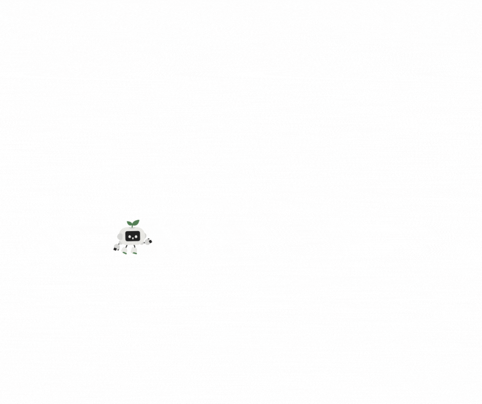
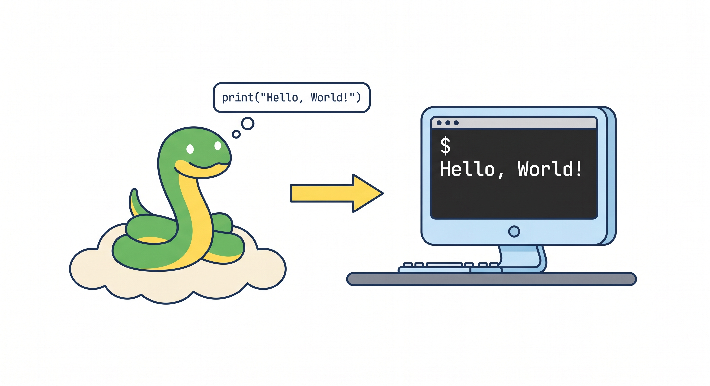

# Lekcja 1 – Podstawy Pythona – pierwsze kroki. Po co programować?

**Czas realizacji:** 45 minut (1 godzina lekcyjna). Podany czas jest przybliżony i należy dostosować go do potrzeb oraz tempa pracy klasy.
{: .lesson-duration }

## Wymagana wiedza

Nie jest wymagana wcześniejsza wiedza – to lekcja wprowadzająca.

## Treści z podstawy programowej

*Wybrane wymagania z podstawy programowej dla klas VII–VIII. [Źródło](https://zpe.gov.pl/podstawa-programowa/szkola-podstawowa/informatyka).*

| Dział | Sekcja |
| --- | --- |
| II. Programowanie i rozwiązywanie problemów z wykorzystaniem komputera i innych urządzeń cyfrowych. Uczeń: | |
| | 1) projektuje, tworzy i testuje programy w procesie rozwiązywania problemów. W programach stosuje: instrukcje wejścia / wyjścia, wyrażenia arytmetyczne i logiczne, instrukcje warunkowe, instrukcje iteracyjne, funkcje oraz zmienne i tablice. W szczególności programuje algorytmy z działu I pkt 2; |
| III. Posługiwanie się komputerem, urządzeniami cyfrowymi i sieciami komputerowymi. Uczeń: | |
| | 3) poprawnie posługuje się terminologią związaną z informatyką i technologią. |

## Wstęp teoretyczny (przewidziany na około 15 minut)

Współczesna informatyka to nie tylko umiejętność korzystania z gotowych aplikacji, ale przede wszystkim rozwiązywanie problemów za pomocą metod informatycznych. Programowanie pozwala nam przejść z roli „cyfrowego konsumenta” do roli „cyfrowego twórcy”.

### Zadanie wprowadzające (7 minut)

Wyobraź sobie, że masz robota, który rozumie tylko bardzo proste polecenia: „narysuj odcinek o długości `X` cm”, „obróć się o `X` stopni w lewo/prawo”.

Na przykład po wykonaniu następujących poleceń:

```
narysuj odcinek o długości 5 cm
obróć się o 90 stopni w lewo
narysuj odcinek o długości 3 cm
obróć się o 90 stopni w prawo
narysuj odcinek o długości 5 cm
obróć się o 90 stopni w lewo
narysuj odcinek o długości 3 cm
obróć się o 90 stopni w prawo
```

Robot narysuje schodki:




Napisz na kartce instrukcję, jak narysować kwadrat, używając tylko poleceń, które zna robot.

**Wniosek**: Komputery są bardzo szybkie, ale wykonują instrukcje dosłownie. Programowanie to proces precyzyjnego wydawania takich instrukcji.

### Podstawowe pojęcia języka Python (8 minut)



W języku Python będziemy korzystać z trzech fundamentów:

* instrukcja wyjścia (`print()`): pozwala komputerowi „mówić” do nas, czyli wyświetlać tekst na ekranie;
* instrukcja wejścia (`input()`): pozwala komputerowi „słuchać”, czyli pobierać dane od użytkownika;
* zmienne: to „pudełka” w pamięci komputera, w których przechowujemy dane, np. liczby lub imiona, aby użyć ich później.

Polecenia dla komputera zapisane w języku Python nazywamy kodem. Przeanalizujmy poniższy kod:

```python
print("Dzień dobry, jestem robotem!")
print("Jak masz na imię?")
imie = input()
print("Cześć", imie, "miło mi cię poznać!")
```

Po uruchomieniu programu możemy przeprowadzić rozmowę z robotem. Po ponownym uruchomieniu robot zaczyna rozmowę od początku.

## Wspólne eksperymenty z językiem Python (10 minut)

Poniższe programy należy uruchomić w środowisku Pythona, na przykład w środowisku Spyder.

```python
print(2+2)
```

```python
print("2+2")
```

Jaka jest różnica między tymi kodami? Jak zachowuje się Python?

```python
print("Kasia" + 2)
```

Błąd wykonania! Nie można dodawać słów i liczb :)

```python
print("Witaj", "Świecie")
```

```python
print("Witaj")
print("Świecie")
```

Możemy wypisywać kilka wyrażeń obok siebie, korzystając z przecinka. Dwa wywołania `print()` wyświetlają tekst w dwóch wierszach.

```python
imie = input()
wiek = int(input())
print(imie, "ma lat", wiek)
```

Funkcja `input()` wczytuje tekst. Aby zamienić wczytany tekst na liczbę całkowitą, używamy funkcji `int()`.

## Zadanie do rozwiązania na komputerze (20 minut)

### Symbole działań matematycznych

Uruchom poniższy program. Co oznaczają symbole `+`, `-`, `/`, `*`?

```python
print(12+2)
print(12-2)
print(12/2)
print(12*2)
```

### Prosty kalkulator (sumator)

Uruchom poniższy program, który wczyta dwie liczby całkowite i wypisze ich sumę.

Python wczytuje dane jako tekst. Aby traktował je jak liczby, należy użyć funkcji `int()`, np.: `liczba = int(input())`.

```python
a = int(input("Podaj pierwszą liczbę: "))
b = int(input("Podaj drugą liczbę: "))
print("Suma wynosi:", a + b)
```

Zmodyfikuj program, żeby wczytywał trzy liczby i wypisywał ich sumę.

### Twoje dane

Napisz program, który poprosi o podanie twojego imienia, wieku oraz ulubionej liczby.
Następnie niech wypisze zdanie:

`[Imię] ma [wiek] lat, a ulubiona liczba pomnożona przez 2 to [wynik]`.

## Zadania do rozwiązania na platformie Szkopuł

*Poniższe opisy są adaptacjami redakcyjnymi treści zadań. Pełne treści są dostępne na platformie Szkopuł.*

### Bond

Poniżej widzisz kod programu, który na ekranie wypisuje komunikat: „HELLO WORLD!”.
Zmodyfikuj treść programu tak, aby wypisywał w pierwszym wierszu komunikat „My name is Bond.”, zaś w drugim wierszu „James Bond.”.

```python
print("HELLO WORLD!")
```

#### Wejście

Twój program nie powinien oczekiwać żadnych danych.

#### Wyjście

W pierwszym wierszu wypisz komunikat: „My name is Bond.”, zaś w drugim wierszu „James Bond.”.

??? tip "Wskazówka"
    W podanym jako przykład kodzie zmień odpowiednio wypisywane słowo. W Pythonie polecenie `print()` samo
    dodaje znak nowej linii na końcu, więc wystarczy, że wywołasz `print()` dwa razy, a wypisane zostaną dwa wiersze.

[Sprawdź kod na Szkopule :fontawesome-solid-paper-plane:](https://szkopul.edu.pl/problemset/problem/qbVEWhU7DxBcjg5p-DgL5072/site/?key=submit){ .md-button .md-button--primary }

**Źródło:** publiczne archiwum zadań serwisu Szkopuł — [odnośnik do zadania](https://szkopul.edu.pl/problemset/problem/qbVEWhU7DxBcjg5p-DgL5072/site/?key=submit).

### Obrus

Mama Tosi kupiła kwadratowy stół o boku `b` centymetrów. Ile centymetrów kwadratowych obrusa potrzebuje, żeby przykryć stół?

Do wczytywania danych skorzystaj z polecenia `b = int(input())`.

#### Wejście

Na wejściu znajduje się jedna liczba całkowita $b$ ($1 \leq b \leq 1000$), będąca długością boku stołu.

#### Wyjście

W pierwszym wierszu należy wypisać pole stołu w centymetrach kwadratowych.

#### Przykład

| Wejście      | Wyjście                          |
| :---------- | :----------------------------------- |
| 12        | 144         |

[Sprawdź kod na Szkopule :fontawesome-solid-paper-plane:](https://szkopul.edu.pl/problemset/problem/5ETn93jOWgwMQuCgsqIUImOl/site/?key=submit){ .md-button .md-button--primary }

**Źródło:** publiczne archiwum zadań serwisu Szkopuł — [odnośnik do zadania](https://szkopul.edu.pl/problemset/problem/5ETn93jOWgwMQuCgsqIUImOl/site/?key=submit).

### Klasy (dla chętnych)

W liceum w Bajtomiu przyjęto nowych uczniów do trzech klas pierwszych. Zapamiętaj liczby
uczniów w każdej klasie, a później je wypisz.

Do wczytania danych wykorzystaj polecenie `a, b, c = map(int, input().split())`.
Jeśli masz problemy z wypisywaniem danych, zerknij na wskazówkę!

#### Wejście

W pierwszym wierszu wejścia znajdują się trzy liczby całkowite $a$, $b$ oraz $c$ ($1 \leq a, b, c \leq 50$),
liczby uczniów odpowiednio w klasach $a$, $b$ i $c$.

#### Wyjście

W pierwszym wierszu wyjścia wypisz liczby uczniów w klasach $a$, $b$ i $c$. W kolejnych trzech
wierszach wypisz nazwy klas (mała litera) oraz (po odstępie) liczbę uczniów w każdej z klas.


#### Przykład

| Wejście      | Wyjście                          |
| :---------- | :----------------------------------- |
| 12 34 23    | 12 34 23 <br> a 12 <br> b 34 <br> c 23  |

??? tip "Wskazówka"
    Do wypisania wartości obok siebie możesz wykorzystać `print()`, podając wartości oddzielone przecinkami, na przykład `print(1, 2, 3, 4)` wypisze `1 2 3 4` obok siebie.

[Sprawdź kod na Szkopule :fontawesome-solid-paper-plane:](https://szkopul.edu.pl/problemset/problem/1Byaj2NLd4w4vLzHQplOs27s/site/?key=submit){ .md-button .md-button--primary }

**Źródło:** publiczne archiwum zadań serwisu Szkopuł — [odnośnik do zadania](https://szkopul.edu.pl/problemset/problem/1Byaj2NLd4w4vLzHQplOs27s/site/?key=submit).
