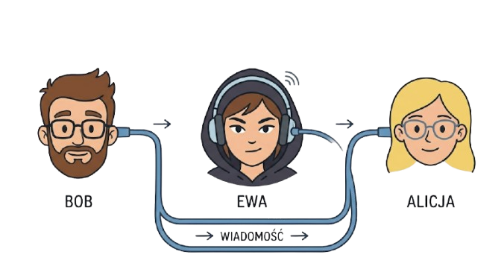
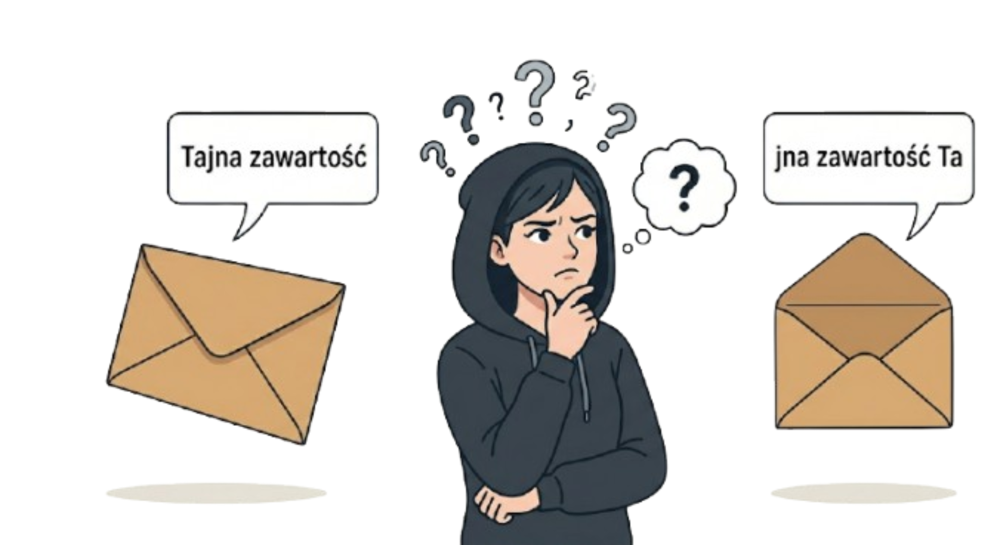
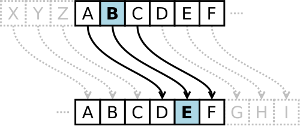

# Lekcja 10 – Podstawy kryptografii – szyfr Cezara i ROT13. Dlaczego są słabym zabezpieczeniem?

**Czas realizacji:** 45 minut (1 godzina lekcyjna). Podany czas jest przybliżony i należy dostosować go do potrzeb oraz tempa pracy klasy.
{: .lesson-duration }

## Wymagana wiedza

- Podstawy języka Python (lekcje 1–9).

- Intuicyjne rozumienie algorytmu jako listy kroków.

- Podstawy myślenia analitycznego i krytyczne podejście do informacji.

## Treści z podstawy programowej

*Wybrane wymagania z podstawy programowej dla klas VII–VIII. [Źródło](https://zpe.gov.pl/podstawa-programowa/szkola-podstawowa/informatyka).*

| Dział | Sekcja |
| --- | --- |
| I. Rozumienie, analizowanie i rozwiązywanie problemów. Uczeń: | |
| | 1) formułuje problem w postaci specyfikacji (czyli opisuje dane i wyniki) oraz wyróżnia kroki w algorytmicznym rozwiązywaniu problemów. […] |
| II. Programowanie i rozwiązywanie problemów z wykorzystaniem komputera i innych urządzeń cyfrowych. Uczeń: | |
| | 1) projektuje, tworzy i testuje programy w procesie rozwiązywania problemów. W programach stosuje: instrukcje wejścia / wyjścia, wyrażenia arytmetyczne i logiczne, instrukcje warunkowe, instrukcje iteracyjne, funkcje oraz zmienne i tablice. W szczególności programuje algorytmy z działu I pkt 2; |
| V. Przestrzeganie prawa i zasad bezpieczeństwa. Uczeń: | |
| | 1) opisuje kwestie etyczne związane z wykorzystaniem komputerów i sieci komputerowych, takie jak: **bezpieczeństwo**, cyfrowa tożsamość, **prywatność**, własność intelektualna, **równy dostęp do informacji i dzielenie się informacją**; |

## Wstęp teoretyczny (przewidziany na około 45 minut)

Znaczna część obecnej komunikacji odbywa się w Internecie. Kiedy wysyłamy wiadomość do kolegi
przez Messengera lub inny komunikator, zakładamy, że ta wiadomość jest **zabezpieczona** i nikt inny nie
będzie mógł jej odczytać.

Zabezpieczaniem wiadomości i łamaniem ich zabezpieczeń ludzkość zajmuje się od wielu wieków.
Dziedzina zajmująca się różnymi metodami utajniania informacji to **kryptografia**, a dzisiaj
poznamy kilka takich metod.

Przy projektowaniu zabezpieczeń musimy założyć, że haker (lub inna osoba planująca przechwycić wiadomość)
może zobaczyć, co znajduje się w kopercie/wiadomości wysłanej siecią. W związku z tym zawartość
musi być **zaszyfrowana**.



Wyobraźmy sobie, że Bob chce wysłać Alicji tajną wiadomość, ale wie, że może ona zostać
przechwycona po drodze. Hakerka Ewa otworzy kopertę, przeczyta jej zawartość, a następnie przekaże
list od Boba do Alicji. Alicja i Bob uzgadniają **klucz** przed wysłaniem wiadomości. Zakładamy, że Ewa zna metodę szyfrowania, ale nie zna klucza.



Zapoznajmy się z poniższą metodą szyfrowania.

### Szyfr Cezara

Jest to metoda, której prawdopodobnie używał Juliusz Cezar, by komunikować się z przyjaciółmi.
Polega ona na zmianie każdej litery alfabetu na inną, przesuwając ją o ustaloną wartość, na przykład **3**.



Przy takim przesunięciu litera **A** zmienia się na literę **D**, litera **B** na **E** i tak dalej.
Warto zauważyć, że ta metoda zamieni literę **Z** na literę **C**.

Zaszyfrujmy słowo `TAJNA`, używając alfabetu angielskiego, bez polskich liter, takich jak `Ż`.

```
T -> W
A -> D
J -> M
N -> Q
A -> D
```

Gdyby Ewa przechwyciła taką wiadomość, zobaczyłaby słowo `WDMQD`, które nie istnieje w języku polskim.

### Wyścig kodołamaczy

Zadanie:

- Podzielcie się na pary: Nadawca i Łamacz.

- Nadawca wybiera klucz (liczbę od 1 do 25) i szyfruje krótkie hasło (np. „PYTHON”).

- Łamacz próbuje odgadnąć hasło, nie znając klucza.

Wnioski: Jak szybko udało się złamać szyfr? Szyfr Cezara jest słabym zabezpieczeniem, ponieważ ma tylko 25 możliwych kluczy. Metoda brute-force (sprawdzenie wszystkich możliwości) zajmuje człowiekowi kilka minut, a komputerowi ułamek sekundy.

### ROT13

ROT13 to specjalny przypadek szyfru Cezara, w którym przesunięcie to `13`. Alfabet angielski ma `26` liter, więc
ta sama metoda zarówno szyfruje, jak i odszyfrowuje wiadomość.

ROT13 jest stosowany na forach internetowych, by zakryć część wiadomości, która mogłaby urazić niektórych
uczestników rozmowy. Na przykład, spojler nowego odcinka serialu mógłby być „zakryty” przed osobami, które
jeszcze go nie obejrzały. Jednocześnie pozostali uczestnicy rozmowy mogą szybko odczytać ukrytą wiadomość.

### Leet speak (Hack-mowa)

W hack-mowie niektóre litery zastępujemy cyframi lub kombinacją znaków, które wyglądają podobnie. Jest to oparty na języku angielskim slang, stosowany w grach i na forach internetowych. Prawdopodobnie widzieliście taki zapis podczas gry, szczególnie w pseudonimach graczy. Leet speak jest sposobem zapisu, który nie zapewnia poufności.

Przykładowe zmiany liter:

```
A -> 4
E -> 3
```

Słowo `HAKER` moglibyśmy wobec tego zakodować jako `H4K3R`.

Większą tabelę kodowania znajdziecie na [Wikipedii](https://pl.wikipedia.org/wiki/Leet_speak
). Zakodujcie słowo `INFORMATYKA`. Czy można tego dokonać na wiele różnych sposobów?

### Metoda podstawieniowa

Metoda podstawieniowa jest trudniejszym do złamania wariantem szyfru Cezara.
Zamiast przesuwać każdą literę o taki sam klucz, możemy przypisać każdej literze dowolnie wybraną inną literę alfabetu,
bez powtórzeń. Na przykład, literze `A` przypisać `Z`, a literze `B` przypisać `D`.

Wspólnie zastanówmy się, jak można złamać taki szyfr.

### Wniosek

Szyfry klasyczne służą tu jako przykłady edukacyjne i nie powinny być używane do ochrony poufnych danych.
