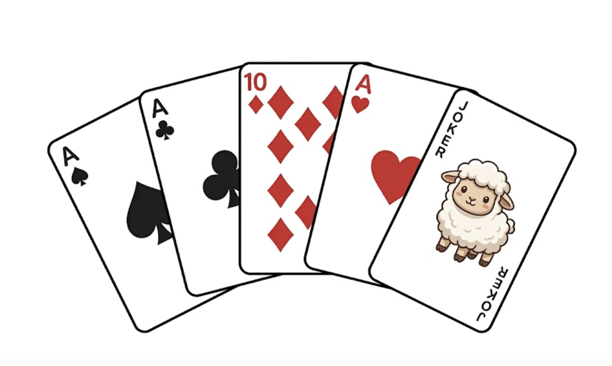

# Wyszukiwanie w zbiorze – Liniowo znajdujemy minimum, maksimum

## Wymagana wiedza

- Listy (`list`)
- Pętla `for` przechodząca po elementach

## Treści z podstawy programowej

| Dział | Sekcja |
| --- | --- |
| I. Rozumienie, analizowanie i rozwiązywanie problemów. | 1) Opisuje dane i wyniki. |
| II. Programowanie i rozwiązywanie problemów. | 1) Stosuje zmienne i tablice. |

## Wstęp teoretyczny (15 minut)

Aby znaleźć najmniejszą liczbę w worku (liście), zakładamy, że pierwsza z brzegu jest najmniejsza, a potem porównujemy ją z każdą kolejną. Jeśli znajdziemy mniejszą – ona staje się naszym nowym "rekordzistą".

## Wspólne eksperymenty (15 minut)

```python
liczby = [7, 3, 9, 1, 5]
najmniejsza = liczby[0]

for x in liczby:
    if x < najmniejsza:
        najmniejsza = x

print("Najmniejsza liczba to:", najmniejsza)
```

## Zadania do rozwiązania (60 minut)

1. **Maksimum**: Napisz program znajdujący największy element w liście.
2. **Pozycja**: Zmodyfikuj program tak, aby oprócz samej wartości wypisał też indeks (miejsce), na którym znajduje się najmniejsza liczba.
3. **Rozpiętość**: Oblicz różnicę między największą a najmniejszą liczbą w zbiorze (tzw. rozstęp).
4. **Średnia bez skrajności**: Oblicz średnią ocen ucznia, ale odrzuć najniższą i najwyższą ocenę (tak jak w skokach narciarskich).

W Pythonie istnieją gotowe funkcje `min(lista)` oraz `max(lista)`, ale warto wiedzieć, jak działają "pod spodem".

## Zadania do rozwiązania na platformie Szkopuł

### Minimum na przedziale

Napisz program, który dla danej tablicy liczb wyznaczy i wypisze wartość minimalną na podanym przedziale indeksów.

Do wczytania danych wykorzystaj polecenia:
`import sys`
`dane = sys.stdin.read().split()`

#### Wejście

W pierwszej linii wejścia znajduje się jedna liczba całkowita $n$ ($1 \le n \le 10^6$), oznaczająca liczbę elementów.

W drugiej linii znajduje się $n$ liczb całkowitych – każda z przedziału od $-10^5$ do $10^5$.

W trzeciej linii znajdują się dwie liczby całkowite oddzielone spacją $a$ oraz $b$ ($0 \le a \le b \le n - 1$), oznaczające początkowy i końcowy indeks przedziału (indeksowanie od $0$).

#### Wyjście

Twój program powinien wypisać jedną liczbę całkowitą – najmniejszą wartość wśród elementów od indeksu $a$ do indeksu $b$ włącznie.

#### Przykład

| Wejście | Wyjście |
| :--- | :--- |
| 6<br>2 5 4 7 1 8<br>1 3 | 4 |

*Wyjaśnienie:*
Dla indeksów od 1 do 3 wartości w liście to odpowiednio: $5$ (indeks 1), $4$ (indeks 2) oraz $7$ (indeks 3). Najmniejsza z tych liczb to $4$.

??? Wskazówka
    Stosując pętlę for lub while, sprawdź każdy element listy pomiędzy indeksami `a` i `b`. 

[Sprawdź kod na Szkopule :fontawesome-solid-paper-plane:](https://szkopul.edu.pl/problemset/problem/minp/site){ .md-button .md-button--primary }

### Mistrzostwa w brydża dla olimpijczyków



Kuba zapisał się na mistrzostwa w brydża dla olimpijczyków. Brydż to szlachetna gra, w której każdy z czterech graczy dostaje rękę złożoną z dokładnie 13 kart ze standardowej talii. Dla pewności: standardowa talia to taka, w której każda z kart: `2`, `3`, `4`, `5`, `6`, `7`, `8`, `9`, `10`, `J`, `Q`, `K`, `A` występuje w dokładnie czterech kopiach (kolory kart są nieważne).

Podstawowy system punktacji ręki jest następujący:
* Walet (`J`) – 1 punkt
* Dama (`Q`) – 2 punkty
* Król (`K`) – 3 punkty
* As (`A`) – 4 punkty
* Pozostałe poprawne karty (`2`–`10`) – 0 punktów

Kuba trenując do turnieju ćwiczy liczenie punktów. W tym celu rozdał sobie $n$ kart i poprosił Cię o wyznaczenie wartości punktowej ręki. Kuba jako znany troll lubi jednak oszukiwać i zaprezentowana ręka niekoniecznie musi być legalna. 

Ręka jest **nielegalna**, jeśli spełniony jest choć jeden z warunków:
1. Nie składa się z dokładnie 13 kart ($n \neq 13$).
2. Zawiera niedozwoloną wartość karty (jakąkolwiek inną niż podane powyżej).
3. Zawiera więcej niż 4 kopie którejś z poprawnych kart.

Do wczytania danych wykorzystaj polecenia:
`import sys`
`dane = sys.stdin.read().split()`

#### Wejście

W pierwszym wierszu wejścia znajduje się jedna liczba całkowita $n$ ($1 \le n \le 52$), oznaczająca liczbę kart na ręce Kuby.

Każdy z kolejnych $n$ wierszy zawiera jeden napis złożony jedynie z cyfr i wielkich liter alfabetu łacińskiego (o długości co najwyżej 5), reprezentujący wartość kolejnej karty.

#### Wyjście

Twój program powinien wypisać jedną liczbę całkowitą – sumaryczną wartość punktową ręki Kuby, o ile jest ona legalna. Jeśli ręka jest niezgodna z zasadami, wypisz słowo `OSZUST!`.

#### Przykład

| Wejście | Wyjście |
| :--- | :--- |
| 13<br>2<br>3<br>4<br>5<br>6<br>7<br>8<br>9<br>10<br>J<br>Q<br>K<br>K | 9 |
| 33<br>2<br>2<br>2<br>2<br>3<br>3<br>3<br>3<br>4<br>4<br>4<br>4<br>5<br>5<br>5<br>5<br>6<br>6<br>6<br>6<br>7<br>7<br>7<br>7<br>8<br>8<br>8<br>8<br>9<br>9<br>9<br>9<br>10 | OSZUST! |

*Wyjaśnienie dla przykładu 1:*
Ręka jest zgodna z zasadami (13 kart), warta 9 punktów: 1 za `J`, 2 za `Q` i 6 za dwa `K`.

*Wyjaśnienie dla przykładu 2:*
33 karty na ręce zamiast 13? OSZUST!

??? Wskazówka
    Najpierw sprawdź, czy $n == 13$. Jeśli nie, od razu wypisz `OSZUST!`. Potem, utwórz listę,
    która zlicza ile razy wystąpiła każda karta. Przejdź po kartach trzymanych przez Kubę,
    i kolejno sprawdzaj, ile razy wystąpił dany rodzaj.
    

[Sprawdź kod na Szkopule :fontawesome-solid-paper-plane:](https://szkopul.edu.pl/problemset/problem/TE3Ga-gbceEEst3mL-gFw_AT/site/?key=statement){ .md-button .md-button--primary }