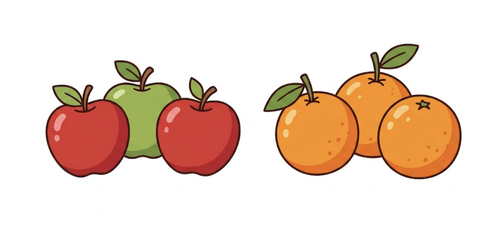

# Lekcja 19 – Biblioteka scikit-learn i uczenie drzew decyzyjnych

**Czas realizacji:** 45 minut (1 godzina lekcyjna). Podany czas jest przybliżony i należy dostosować go do potrzeb oraz tempa pracy klasy.
{: .lesson-duration }

## Wymagana wiedza

- Podstawy funkcji i list.
- Instalacja bibliotek (`pip install scikit-learn`).

## Treści z podstawy programowej

*Wybrane wymagania z podstawy programowej dla klas VII–VIII. [Źródło](https://zpe.gov.pl/podstawa-programowa/szkola-podstawowa/informatyka).*

| Dział | Sekcja |
| --- | --- |
| I. Rozumienie, analizowanie i rozwiązywanie problemów. Uczeń: | |
| | 1) formułuje problem w postaci specyfikacji (czyli opisuje dane i wyniki) oraz wyróżnia kroki w algorytmicznym rozwiązywaniu problemów. […] |
| II. Programowanie i rozwiązywanie problemów z wykorzystaniem komputera i innych urządzeń cyfrowych. Uczeń: | |
| | 1) projektuje, tworzy i testuje programy w procesie rozwiązywania problemów. W programach stosuje: instrukcje wejścia / wyjścia, wyrażenia arytmetyczne i logiczne, instrukcje warunkowe, instrukcje iteracyjne, funkcje oraz zmienne i tablice. W szczególności programuje algorytmy z działu I pkt 2; |

## Wstęp teoretyczny (5 minut)

Zamiast ręcznie pisać instrukcje `if`, możemy pozwolić komputerowi „nauczyć się” zasad na podstawie przykładów. Do tego służy biblioteka **scikit-learn**.

## Przykład kodu (20 minut)



Nauczymy komputer rozpoznawać, czy owoc to jabłko czy pomarańcza na podstawie masy owocu i rodzaju jego skórki.
Na potrzeby ćwiczenia przyjmujemy uproszczony zestaw danych o masie owoców i rodzaju skórki. Model będzie uczył się na przykładach opisanych za pomocą **cech (`features`)** i **etykiet (`labels`)**, wskazujących rodzaj owocu. Następnie podamy mu nowy przykład i sprawdzimy wynik klasyfikacji.

```python
from sklearn import tree

# Dane: [masa w gramach, tekstura (0-gładka, 1-szorstka)]
features = [[140, 0], [120, 0], [200, 1], [210, 1], [250, 1]]
# Wyniki: 0 dla jabłka, 1 dla pomarańczy
labels = [0, 0, 1, 1, 1]

clf = tree.DecisionTreeClassifier(random_state=67)
print("Rozpoczynam uczenie...")
clf = clf.fit(features, labels)
print("Koniec uczenia! Pora na test.")

wynik = clf.predict([[130, 0]])[0]
print("Gładka skórka, masa 130 gramów.")
if wynik == 0:
    print("To jabłko!")
else:
    print("To pomarańcza!")

# wyjątkowo duże jabłko
wynik = clf.predict([[220, 0]])[0]
print("Gładka skórka, masa 220 gramów.")
if wynik == 0:
    print("To jabłko!")
else:
    print("To pomarańcza!")
```

!!! note "Uwaga"
    To, co zrobiliśmy, nazywa się **uczeniem nadzorowanym** (supervised learning).

## Zadania do rozwiązania (20 minut)

1. **Więcej testów**: Dodaj więcej testów owoców, sprawdź małe jabłko i małą pomarańczę.

2. **Śmieci na wejściu, śmieci na wyjściu (GIGO)**: Zbadaj wpływ błędnej etykiety na model.
   Dodaj do danych przykład pomarańczy (masa `190` gramów, skórka szorstka `1`), ale na liście `labels` przypisz jej złą etykietę: `0` (jabłko). Uruchom ponownie program.

   **Pytanie:** Porównaj przewidywania dla tych samych owoców przed dodaniem błędnie oznaczonego przykładu i po nim. Czy wynik się zmienił? Spróbuj wyjaśnić dlaczego.

!!! warning "Garbage In, Garbage Out"
    Model uczy się na przekazanych przykładach. Błędne, niepełne lub niereprezentatywne dane mogą pogorszyć jakość jego przewidywań. Określenie **Garbage In, Garbage Out** oznacza „śmieci na wejściu, śmieci na wyjściu”.

3. **Jedna cecha mniej**: Usuń informację o rodzaju skórki (zostaw samą masę) z danych uczących i wszystkich przykładów przekazywanych do `predict()` i sprawdź, jak wpływa na wynik. Czy model stał się „mądrzejszy”?
