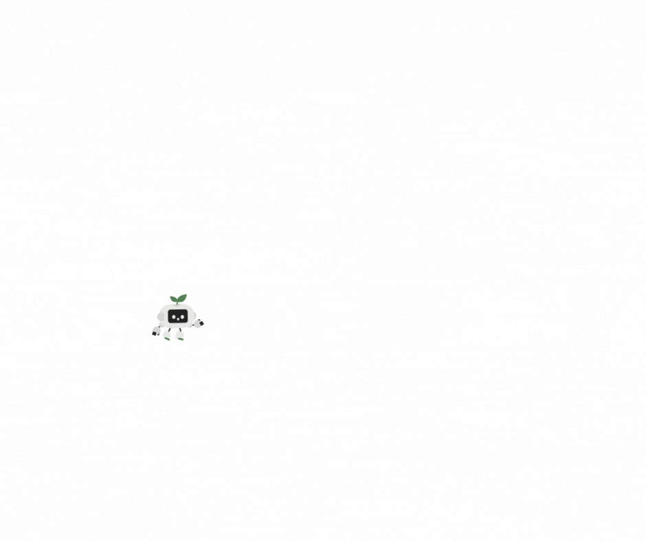

# Pętle for i while – iteracje, przerwania (break, continue). Jak sobie poradzić z powtarzalną pracą?

## Wymagana wiedza

- Podstawy składni języka Python: instrukcje wejścia/wyjścia (input(), print()) oraz zmienne.
- Umiejętność stosowania instrukcji warunkowych (if, elif, else) oraz operatorów logicznych (and, or).
- Rozumienie pojęcia algorytmu jako listy kroków prowadzącej do rozwiązania problemu.

## Treści z podstawy programowej

| Dział      | Sekcja                          |
| ----------- | ------------------------------------ |
| I. Rozumienie, analizowanie i rozwiązywanie problemów. Uczeń:      |  |
|       | 1) Formułuje problem w postaci specyfikacji (czyli opisuje dane i wyniki) i wyróżnia kroki w algorytmicznym rozwiązywaniu problemów. |
| II. Programowanie i rozwiązywanie problemów z wykorzystaniem komputera i innych urządzeń cyfrowych. Uczeń:       |  |
| | 1) W programach stosuje: instrukcje wejścia/wyjścia, wyrażenia arytmetyczne i logiczne, instrukcje warunkowe, **instrukcje iteracyjne**, funkcje oraz zmienne i tablice. |

## Wstęp teoretyczny (przewidziany na około 20 minut)

Programowanie pozwala nam przejść z roli konsumenta do roli twórcy, a jedną z najpotężniejszych umiejętności twórcy jest automatyzacja. Komputery są niezwykle szybkie w wykonywaniu powtarzalnych instrukcji, które dla ludzi byłyby nużące. Służą do tego pętle (instrukcje iteracyjne).

### Sterowanie robotem - wersja trudniejsza (10 minut)

Wyobraź sobie, że masz robota, który rozumie tylko bardzo proste polecenia: "narysuj odcinek o długości `X` cm", "obróć się o `X` stopni w lewo/prawo" oraz "powtórz `X` razy".

Na przykład, dla komend:

```
Powtórz 2 razy: 
    narysuj odcinek o długości 5 cm, 
    obróć się o 90 stopni w lewo, 
    narysuj odcinek o długości 3 cm, 
    obróć się o 90 stopni w prawo
```

Robot narysuje schodki:



Napisz na kartce instrukcję, jak narysować kwadrat, używając tylko trzech komend, które zna robot.

Jest to prostsze, niż poprzednim razem.

**Wniosek:** Pętla „powtórz” (w Pythonie for lub while) pozwala nam uniknąć nużącego przepisywania tych samych komend wiele razy.

### Sterowanie robotem i warunki zatrzymania (5 minut)

Jedno dziecko staje się robotem, a pozostali wydają mu polecenia sterujące:

- Polecenie: „Dopóki (while) nie dotkniesz ściany, idź naprzód o jeden krok”.
- Polecenie z break: „Jeśli usłyszysz klaśnięcie, natychmiast przestań (break)”.

### Analogia sportowa

Analogię pętli można porównać do treningu sportowego – zamiast mówić zawodnikowi sto razy „zrób pompkę”, trener wydaje jedno polecenie: „zrób serię 100 pompek” (for) lub „rób pompki, aż powiem stop” (while).

### Składnia w języku Python

Zapisanie `while` w Python jest podobne do warunku `if`:

```Python
while warunek:
    # wykonuj
```

Pętla `for` jest bardziej skomplikowana:

```Python
for i in range(0, 5):
    print(i)
```

Żeby przerwać wykonanie pętli, stosujemy `break`.

```Python
while warunek:
    print("OK!")
    break
```

1. Pętla for: Używamy jej, gdy wiemy dokładnie, ile razy coś ma się powtórzyć lub chcemy przejść przez jakiś zbiór elementów (np. listę liczb).
    - Przykład: for i in range(5): wykona kod 5 razy.
2. Pętla while: Działa tak długo, jak długo spełniony jest określony warunek logiczny.
    - Przykład: „Dopóki herbata jest gorąca, czekaj”.
3. Instrukcje przerwania:
    - break: Natychmiastowe wyjście z pętli (np. gdy znajdziemy szukany element).


## Wspólne eksperymenty z językiem Python (20 minut)

Przetestujmy zachowanie pętli w środowisku programistycznym. Przeanalizuj poniższe kody,
a następnie je uruchom.

```Python
wiek = 5
while x >= 18:
    print("Pełnoletni!")
```

```Python
wiek = 20
while x >= 18:
    print("Pełnoletni!")
```

Co się dzieje, gdy warunek zawsze jest prawdziwy?

```Python
x = 5
while x >= 18:
    print("Pełnoletni!")
```

Za pomocą pętli `while`, możemy zasymulować odliczanie do nowego roku:

```Python
ile_sekund_zostalo = 10
while ile_sekund_zostalo > 0:
    print(ile_sekund_zostalo)
    ile_sekund_zostalo = ile_sekund_zostalo - 1
print("Wszystkiego dobrego w nowym roku!")
```

Możemy wykorzystać pętle do wczytania danych wielokrotnie

```Python
while True:
    liczba = int(input())
    if liczba == 7:
        print("Wczytana szczęśliwa siódemka, przerywam wykonanie pętli!")
        break
    print("Wczytana liczba to", liczba)
```

## Zadania do rozwiązania na komputerze (przewidziane na około 50 minut)

Podczas pracy nad poniższymi problemami skup się na poprawnym zastosowaniu instrukcji iteracyjnych (for, while) oraz wyrażeń arytmetycznych i logicznych.

Pamiętaj, że każdy algorytm iteracyjny wymaga jasnej specyfikacji, czyli określenia, jakie masz dane wejściowe i jaki wynik chcesz osiągnąć. Jeśli Twój program wpada w „pętlę nieskończoną” (nie przestaje wypisywać liczb), możesz go przerwać w większości środowisk skrótem `Ctrl+C`.

1. Licznik: Wypisz liczby od 1 do 30. Wykorzystaj do tego pętlę for oraz funkcję range(), pamiętając, że jej prawy zakres jest otwarty.
2. ASCII-Art: Narysuj z gwiazdek (*) kwadrat o boku 5 oraz/lub prostą choinkę. To zadanie uczy, jak za pomocą pętli tworzyć powtarzalne wzory graficzne.
3. Parzystość: Wypisz liczby od 1 do 30, które są parzyste. Wykorzystaj instrukcję if z operatorem modulo (% 2 == 0) wewnątrz pętli.
4. Zakres użytkownika: Wczytaj dwie liczby A i B. Wypisz wszystkie liczby od A do B. Pamiętaj o obsłużeniu sytuacji, w której A jest większe od B.
5. Złożona podzielność: Wypisz liczby od 1 do 100, które są podzielne przez 2 lub 3, ale jednocześnie niepodzielne przez 6. To świetne ćwiczenie na łączenie operatorów and, or oraz not.
6. Potęgi trójki: Wypisz kolejne potęgi liczby 3, które są mniejsze od 1000. Użyj pętli while, która będzie sprawdzać warunek wielkości wyniku przed każdym powtórzeniem.
7. Licznik potęg: Policz i wypisz, ile jest potęg dwójki mniejszych od 10000. W tym zadaniu musisz stworzyć zmienną pełniącą rolę licznika, którą zwiększysz o 1 przy każdej iteracji.
8. Silnia (n!): Wczytaj liczbę n, a następnie oblicz silnię według wzoru: n!=1⋅2⋅⋯⋅n. Pamiętaj, aby zmienna przechowująca wynik (akumulator) miała na początku wartość 1, a nie 0.
9. Suma przedziału: Wczytaj liczby A i B. Oblicz i wypisz sumę wszystkich liczb znajdujących się w przedziale od A do B

## Zadania do rozwiązania na platformie Szkopuł

### Śmiech informatyka i matematyka

Jak śmieje się matematyk? $(Ha)^3$ albo $(Ha)^{10}$, jeśli jest bardzo rozbawiony.

Jak śmieje się informatyk? Wypisuje na konsoli `Ha` tyle razy, jak bardzo się cieszy.

Ponieważ jesteś informatykiem, jednym z Twoich zadań jest napisanie programu, który będzie się śmiał za Ciebie. A więc do dzieła!

Do wczytania danych wykorzystaj polecenie `n = int(input())`.

#### Wejście

Wejście składa się z jednej liczby naturalnej $n$ ($1 \leq n \leq 10\,000$), oznaczającej jak bardzo rozbawiony jest informatyk.

#### Wyjście

Program powinien w pojedynczej linii wypisać tekst `Ha` dokładnie $n$ razy. Każde dwa napisy `Ha` muszą być oddzielone pojedynczym odstępem.

#### Przykład

| Wejście | Wyjście |
| :--- | :--- |
| 2 | Ha Ha |
| 5 | Ha Ha Ha Ha Ha |

??? Wskazówka
    Zastosuj pętlę, która wykona `n` powtórzeń. Żeby nie oddzielać wyrażeń nową linią, zastosuj polecenie 
    `print('Ha', end=" ")`

[Zobacz zadanie na Szkopule :fontawesome-solid-paper-plane:](https://szkopul.edu.pl/problemset/problem/W-j2XQW1kC2sRuNtGwTEbGeQ/site/?key=statement){ .md-button .md-button--primary }

### Koszykarz


Kozik pragnie zostać koszykarzem. Po rozmowie z trenerem okazało się, że jest za niski. Kozik jest jednak tak zdeterminowany, że chce spełnić wymagania trenera, nawet jeśli okazałoby się to oszustwem.

Wpadł więc na genialny pomysł robienia sobie guzów na głowie, aż osiągnie wymagany wzrost. Zauważył, że przy każdym uderzeniu guz powiększa się o $a$ cm. Kozik zastanawia się, ile minimalnie razy będzie musiał się uderzyć.

Do wczytania danych wykorzystaj polecenie `k, w, a = map(int, input().split())`.

#### Wejście

W pierwszej i jedynej linii wejścia znajdują się trzy liczby całkowite $k, w, a$ ($1 \le k, w, a \le 1\ 000\ 000\ 000$), oznaczające odpowiednio aktualną wysokość Kozika, wymaganą przez trenera wysokość oraz przyrost wysokości po każdym uderzeniu.

#### Wyjście

Pierwszy i jedyny wiersz wyjścia powinien zawierać jedną liczbę całkowitą równą minimalnej liczbie uderzeń, które musi wykonać Kozik, aby osiągnąć wzrost co najmniej $w$.

#### Przykład

| Wejście | Wyjście |
| :--- | :--- |
| 180 202 10 | 3 |

??? Wskazówka
    Różnicę wzrostu do nadrobienia stanowi $w - k$. Jeśli $k \ge w$, Kozik nie musi się uderzać wcale ($0$ razy). Zastanów się, czy to zadanie musisz wykonać za pomocą pętli? A może wystarczy działanie
    dzielenia?

[Zobacz zadanie na Szkopule :fontawesome-solid-paper-plane:](https://szkopul.edu.pl/problemset/problem/Iq7nk3Jqo4PzMs5MIx-sI2ET/site/?key=statement){ .md-button .md-button--primary }

### Kwadrat

Napisz program, w którym użytkownik wprowadzi jedną liczbę nieparzystą $n$.

Twoim zadaniem jest wypisanie wzoru o wymiarach $n \times n$ złożonego ze znaków `@`.

Do wczytania danych wykorzystaj polecenie `n = int(input())`.

#### Wejście

W jedynym wierszu wejścia znajduje się jedna nieparzysta liczba całkowita $n$ ($2 < n < 1002$).

#### Wyjście

Na wyjściu wypisz $n$ wierszy po $n$ znaków w każdym, tworzących wzór złożony ze znaków `@` oraz `X`.

#### Przykład

| Wejście | Wyjście |
| :--- | :--- |
| 5 | @@@@@<br>@@@@@<br>@@@@@<br>@@@@@<br>@@@@@ |
| 7 | @@@@@@@<br>@@@@@@@<br>@@@@@@@<br>@@@@@@@<br>@@@@@@@<br>@@@@@@@<br>@@@@@@@ |

??? Wskazówka
    W Pythonie możesz wypisać wiele razy ten sam znak, korzystając z mnożenia: `'#'*5`

[Zobacz zadanie na Szkopule :fontawesome-solid-paper-plane:](https://szkopul.edu.pl/problemset/problem/m7d6WQdRnYjrZQo6s3g6v5hY/site/?key=statement){ .md-button .md-button--primary }

