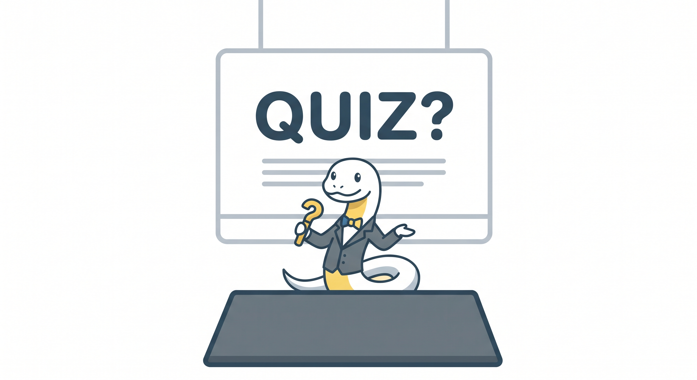

# Lekcja 5 – Zastosowanie praktyczne – quiz. Jak wykorzystać to, co umiem?

**Czas realizacji:** 90 minut (2 godziny lekcyjne). Podany czas jest przybliżony i należy dostosować go do potrzeb oraz tempa pracy klasy.
{: .lesson-duration }

## Wymagana wiedza

- Podstawy języka Python: instrukcje wejścia/wyjścia (`input()`, `print()`).

- Stosowanie zmiennych do przechowywania danych.

- Instrukcje warunkowe (`if`, `else`) do podejmowania decyzji przez program.

## Treści z podstawy programowej

*Wybrane wymagania z podstawy programowej dla klas VII–VIII. [Źródło](https://zpe.gov.pl/podstawa-programowa/szkola-podstawowa/informatyka).*

| Dział | Sekcja |
| --- | --- |
| II. Programowanie i rozwiązywanie problemów z wykorzystaniem komputera i innych urządzeń cyfrowych. Uczeń: | |
| | 1) projektuje, tworzy i testuje programy w procesie rozwiązywania problemów. W programach stosuje: instrukcje wejścia / wyjścia, wyrażenia arytmetyczne i logiczne, instrukcje warunkowe, **instrukcje iteracyjne**, funkcje oraz zmienne i tablice. W szczególności programuje algorytmy z działu I pkt 2; |
| I. Rozumienie, analizowanie i rozwiązywanie problemów. Uczeń: | |
| | 1) formułuje problem w postaci specyfikacji (czyli opisuje dane i wyniki) oraz wyróżnia kroki w algorytmicznym rozwiązywaniu problemów. […] |
| IV. Rozwijanie kompetencji społecznych. Uczeń: | |
| | 1) bierze udział w różnych formach współpracy, jak: […] realizacja projektów, […] projektuje, tworzy i prezentuje efekty wspólnej pracy; |

## Wstęp do projektu (10 minut)



Zamiast rozwiązywać krótkie zadania, uczniowie stworzą kompleksowy program – quiz, który będzie sprawdzał wiedzę użytkownika na wybrany temat (np. sport, historia, gry wideo). Program musi:

- zadawać pytania;

- pobierać odpowiedzi od użytkownika;

- reagować na to, czy odpowiedź jest poprawna (używając instrukcji warunkowych).

Szkielet gry:

```python
# Powitanie
print("Witaj w Wielkim Quizie Wiedzy!")

# Pytanie 1
print("Jak nazywa się stolica Polski?")
print("A. Warszawa B. Kraków C. Żyrardów D. Poznań")
odpowiedz1 = input()


if odpowiedz1 == "A":
    print("Brawo! To poprawna odpowiedź.")
else:
    print("Niestety, to błąd. Koniec gry!")
    exit() # Program kończy działanie przy złej odpowiedzi

# Tutaj dodaj kolejne pytania...
```

## Samodzielna implementacja i pomysły na rozszerzenie programu (45 minut)

Chętni mogą rozszerzyć podstawową wersję gry o następujące elementy:

* koła ratunkowe, na przykład odrzucenie połowy odpowiedzi;

* akceptowanie odpowiedzi w różnych formach: „A”, „a” oraz „Warszawa”;

* system punktów i gwarantowanych wygranych;

* ocenę wyniku na końcu gry, np. komunikat „Jesteś ekspertem!”, jeśli liczba punktów jest większa niż 5.

## Podsumowanie i prezentacja projektów (35 minut)

Po zakończeniu pracy każdy z uczniów prezentuje swój quiz klasie, korzystając z projektora. Wspólne omawianie wyników i rozgrywka
sprzyjają budowaniu kompetencji społecznych i pozwalają na wymianę doświadczeń programistycznych.
Testowanie własnego rozwiązania i wprowadzanie korekt to naturalna część pracy programisty.
