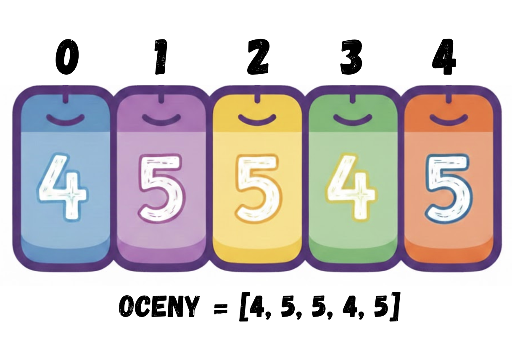

# Lista, słowa – kiedy zmienna nie wystarcza

## Wymagana wiedza

- Podstawy języka Python: instrukcje wejścia/wyjścia (input(), print()).
- Stosowanie zmiennych do przechowywania danych.
- Instrukcje warunkowe (if, else) do podejmowania decyzji przez program.
- Pętle for i while.
- Stosowanie własnych funkcji (def, return).

## Treści z podstawy programowej

| Dział      | Sekcja                          |
| ----------- | ------------------------------------ |
| I. Rozumienie, analizowanie i rozwiązywanie problemów. Uczeń:      |  |
|       | 1) Formułuje problem w postaci specyfikacji (czyli opisuje dane i wyniki) i wyróżnia kroki w algorytmicznym rozwiązywaniu problemów. |
| II. Programowanie i rozwiązywanie problemów z wykorzystaniem komputera i innych urządzeń cyfrowych. Uczeń:       |  |
| | 1) W programach stosuje: instrukcje wejścia/wyjścia, wyrażenia arytmetyczne i logiczne, instrukcje warunkowe, instrukcje iteracyjne, funkcje oraz zmienne i **tablice**. |

## Wstęp teoretyczny (przewidziany na około 10 minut)

Do tej pory używaliśmy zmiennych jako pojedynczych „pudełek” na dane. Jednak w informatyce często musimy zarządzać setkami lub tysiącami informacji naraz (np. listą uczniów w szkole lub postaciami w grze komputerowej). Tworzenie oddzielnej zmiennej dla każdego elementu byłoby niemożliwe.

W Pythonie istnieją specjalne **struktury** do przechowywania danych, dzisiaj poznamy kilka z nich:

### Lista

**Lista (list)**: To uporządkowany zbiór elementów. Możesz ją sobie wyobrazić jako regał z ponumerowanymi szufladami. Do każdej szuflady możemy zajrzeć, używając indeksu (numeru szuflady). Możemy również dodawać kolejne szuflady
za pomocą polecenia `append()`. Za pomocą `len`, możemy sprawdzić liczbę elementów w liście.



Przeanalizujmy następujący program

```Python
oceny = [4, 5, 5, 4, 5]
print("Pierwsza ocena: ", oceny[0])
print("Druga ocena: ", oceny[1])
print("Ile ocen? ", len(oceny))

oceny.append(3)
print("Pierwsza ocena: ", oceny[0])
print("Ile ocen? ", len(oceny))
```

**Wyzwanie**: Uzupełnij luki tak, aby program działał poprawnie

```Python
oceny = [4, 5, 5, 4, 5]
print("Druga ocena: ", oceny[???])
print("Ostatnia ocena: ", oceny[???])

oceny.append(3)
print("Ostatnia ocena: ", oceny[???])

suma_ocen = sum(oceny)
ile_ocen = len(oceny)
print("Średnia ocen: ", ???)
```

### Słowa

**Słowa (string)**: W Pythonie słowo to w rzeczywistości ciąg znaków (liter). Możemy wyciągnąć pojedynczą literę ze słowa tak samo, jak element z listy.

```Python
imie = "Michal"
print(imie[0])
print(len(imie))
```

## Wspólne eksperymenty w języku Python (15 minut)

Uruchom poniższe przykłady, aby zobaczyć, jak w Pythonie wykorzystać listy:

### Pętla po liście

```Python
lista = [4, 5, 3, 1]
for i in range(len(lista)):
    print(lista[i])
```

**Wyzwanie**: Napisz program, który wypisze co drugi element listy

### Wczytywanie danych do listy (dane oddzielone znakiem nowej linii)

```Python
ile_liczb_bedzie = int(input())
lista = []
for i in range(ile_liczb_bedzie):
    liczba = int(input("Podaj liczbę"))
    lista.append(liczba)
print(lista)
```

### Wczytywanie danych do listy (dane oddzielone spacją)

Zbadajmy działanie polecenia `split()`:

```Python
bardzo_dlugie_slowo = "Ala ma kota"
slowa = bardzo_dlugie_slowo.split()
print(slowa)
```

Teraz możemy wczytywać słowa oddzielone spacją za pomocą polecenia `input()`!

```Python
imiona = input().split() # Aleksandra Basia Celina
print(imiona[0]) # Aleksandra
print(imiona[1]) # Celina
```

Sytuacja komplikuje się, gdy wczytywane są liczby. Żeby je wczytać, musimy
podzielić `input()` na pojedyncze fragmenty używając `split()`. Problem:
wczytane dane są słowami, a nie liczbami! Żeby to naprawić, musimy zastosować `int()` na
każdym elemencie listy.

```Python
lista = input().split()
print(lista)
for i in range(len(lista)):
    # Weź i-ty element
    x = lista[i]
    # Zmień na liczbę
    lista[i] = int(x)
print(lista)
```

Dla zaawansowanych: powyższy kod można skrócić, korzystając z polecenia `map()`:

```Python
lista = map(int, input().split())
print(lista)
```

## Zadania do rozwiązania na komputerze (przewidziane na około 20 minut)

Z poniższych zadań wybierz `2` i zaimplementuj je na komputerze.

- **Parzyste liczby**: Wczytaj 10 liczb całkowitych. Napisz program, który przejdzie przez listę liczb i wypisze tylko te liczby, które są parzyste. Podpowiedź: Wykorzystaj pętlę for oraz operator modulo `% 2 == 0`.
- **Lista od tyłu**: Wczytaj od użytkownika 5 słów i zapisz je na liście. Następnie wypisz te słowa w odwrotnej kolejności (od ostatniego do pierwszego).
- **Co drugi element**: Wczytaj listę imion (np. 6-8 słów), wypisz co drugie imię z tej listy (indeksy 0, 2, 4...).
- **Filtr bezpieczeństwa**: Wczytaj listę słów, która zawiera różne wyrazy oraz słowo "zakazane" (może występować kilka razy). Napisz program, który wypisze wszystkie elementy tej listy oprócz słowa "zakazane".
- **Suma ocen**: Wczytaj listę liczb - ocen z matematyki. Napisz funkcję, która obliczy ich sumę **bez używania gotowej funkcji sum()**, przechodząc przez listę element po elemencie.
- **Analizator długości**: Wczytaj listę nazw miast. Wypisz tylko te nazwy, które mają więcej niż 5 liter. Podpowiedź: Wykorzystaj funkcję wbudowaną len() do sprawdzenia długości każdego słowa.

Zadanie dla wszystkich:

**Poszukiwacz skarbów**: Wczytaj listę 10 liczb. Poproś użytkownika o podanie jednej liczby i sprawdź, czy znajduje się ona na liście. Jeśli tak, wypisz jej numer indeksu.

## Zadania do rozwiązania na platformie Szkopuł

### Woda Czyści

Czy wiesz, od czego wziął się skrót **OKI**? Myślisz, że od *Olimpijskie Koło Informatyczne*?
Otóż nie! OKI to *Ojej, Ktoś Informatyczny*!

A czy wiesz, skąd pochodzi słowo **POT**? Nie zastanawiałeś(-aś) się? Szkoda, bo to proste! To skrót od *Pamiętaj O Treningu*!

Jak widzisz, skróty nie zawsze są oczywiste. Mówimy *kreatywni odkrywcy nowych kierunków – uśmiech, radość, sukces*, a to przecież konkurs!

Dlatego wielka prośba: napisz program, który automatycznie generuje skrót z podanych wyrazów (akronim utworzony z pierwszych liter każdego ze słów).

I nie zapomnij! **WC! Woda Czyści!**

Do wczytania danych wykorzystaj polecenie:
`import sys`
`słowa = sys.stdin.read().split()`

#### Wejście

W pierwszym wierszu wejścia znajduje się jedna liczba całkowita $n$ ($1 \le n \le 100\ 000$), oznaczająca liczbę słów.

W kolejnych $n$ wierszach znajdują się słowa. W $i$-tym z nich znajduje się jedno słowo złożone z małych i dużych liter alfabetu angielskiego.

Suma długości wszystkich słów na wejściu nie przekroczy $500\ 000$.

#### Wyjście

W jedynym wierszu wyjścia wypisz jedno słowo – skrót utworzony z pierwszych liter kolejnych słów z wejścia.

#### Przykład

| Wejście | Wyjście |
| :--- | :--- |
| 4<br>Mistrz<br>Programowania<br>runda<br>pierwsza | MPrp |
| 1<br>qwerty | q |
| 3<br>d<br>e<br>f | def |

*Wyjaśnienie dla pierwszego przykładu:*
Są 4 słowa. Pierwsze litery tych słów (`M`, `P`, `r`, `p`) tworzą skrót `MPrp`.

??? Wskazówka
    Aby wczytać bardzo szybko dużą liczbę wierszy ($100\ 000$), warto użyć modułu `sys.stdin.read().split()`. Pierwszym elementem wczytanej listy będzie liczba $n$, a kolejnymi elementami będą słowa.
    Pierwszą literę każdego słowa możesz pobrać za pomocą indeksu `[0]`, następnie wypisywać ją poleceniem `print(litera, end="")`.


[Sprawdź kod na Szkopule :fontawesome-solid-paper-plane:](https://szkopul.edu.pl/problemset/problem/jAqYLpzf_o8fRGM8PW37L6zJ/site/?key=statement){ .md-button .md-button--primary }