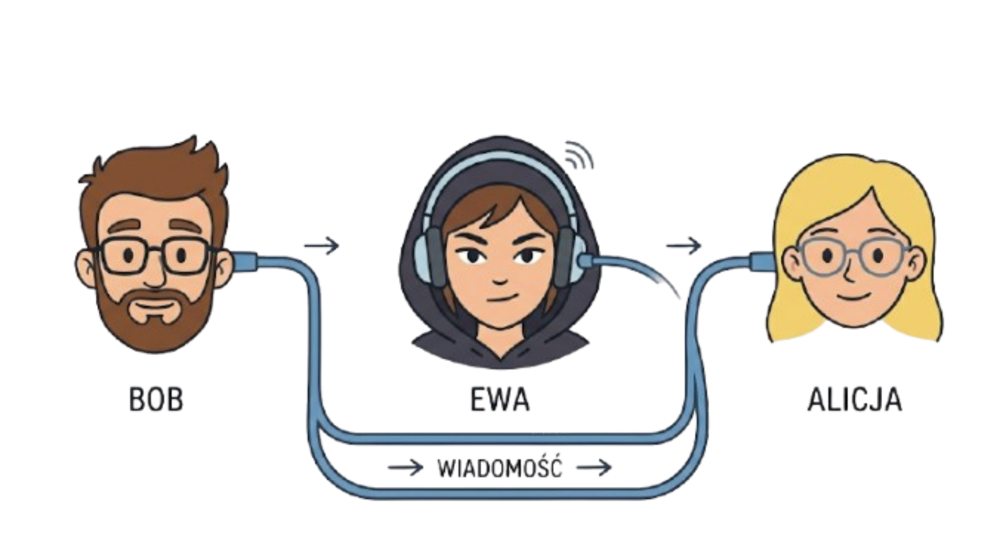
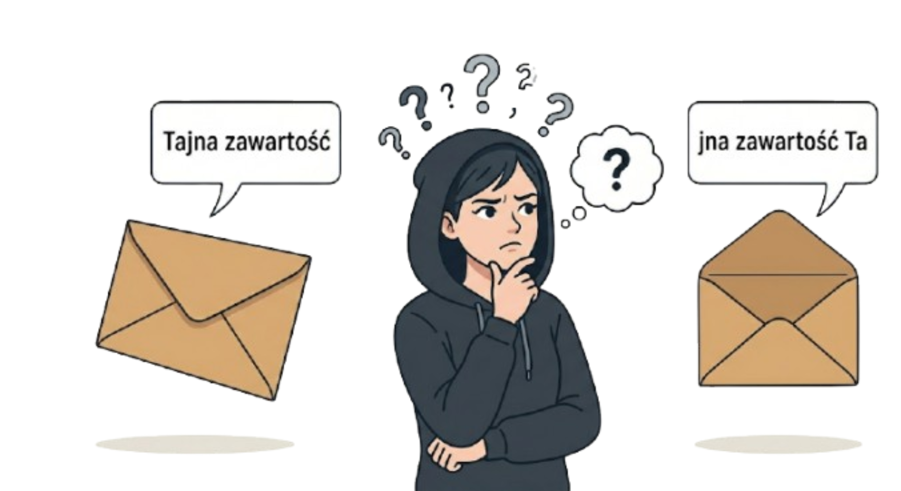
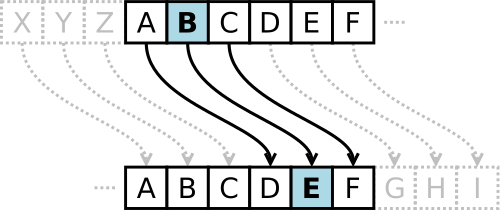

# Podstawy kryptografii – Poznajemy szyfr Cezara, rot13. Dlaczego są słabym zabezpieczeniem?

## Wymagana wiedza

- Podstawy języka Python (lekcje 1-9)
- Intuicyjne rozumienie algorytmu jako listy kroków
- Podstawy myślenia analitycznego i krytyczne podejście do informacji

## Treści z podstawy programowej

| Dział      | Sekcja                          |
| ----------- | ------------------------------------ |
| I. Rozumienie, analizowanie i rozwiązywanie problemów. Uczeń:      |  |
|       | 1) Formułuje problem w postaci specyfikacji (czyli opisuje dane i wyniki) i wyróżnia kroki w algorytmicznym rozwiązywaniu problemów. |
| II. Programowanie i rozwiązywanie problemów z wykorzystaniem komputera i innych urządzeń cyfrowych. Uczeń:       |  |
| | 1) W programach stosuje: instrukcje wejścia/wyjścia, wyrażenia arytmetyczne i logiczne, instrukcje warunkowe, instrukcje iteracyjne, funkcje oraz zmienne i tablice. |
| V. Przestrzeganie prawa i zasad bezpieczeństwa. Uczeń: | |
| | 1) Opisuje kwestie etyczne związane z wykorzystaniem komputerów i sieci komputerowych, takie jak: **bezpieczeństwo**, cyfrowa tożsamość, **prywatność**, **równy dostęp do informacji i dzielenie się informacją**; | 

## Wstęp teoretyczny (przewidziany na około 45 minut)

Znaczna część obecnej komunikacji odbywa się w Internecie. Kiedy wysyłamy wiadomość do kolegi
na Messengerze lub innym komunikatorze, zakładamy, że ta wiadomość jest **zabezpieczona** i nikt inny nie
będzie mógł jej odczytać.

Problemem zabezpieczenia (oraz łamania zabezpieczeń) wiadomości ludzkość zajmuje się od wielu wieków.
Dziedzina zajmująca się różnymi metodami utajniania informacji to **kryptografia**, a dzisiaj
poznamy kilka takich metod.

Przy projektowaniu zabezpieczeń musimy założyć, że haker (lub inna osoba planująca przechwycić wiadomość)
może zobaczyć, co znajduje się w kopercie/wiadomości wysłanej siecią. W związku z tym, zawartość
musi być **zaszyfrowana**.



Wyobraźmy sobie, że Bob chce wysłać Alicji tajną wiadomość, ale wie, że może ona zostać
przechwycona po drodze. Hakerka Ewa otworzy kopertę, przeczyta jej zawartość, a następnie przekaże
list od Boba do Alicji. Alicja i Bob ustalą **metodę szyfrowania** przed wysłaniem listu. Ewa go nie zna,
więc nawet otwierając kopertę, nie dowie się prawdziwej wiadomości.



Zapoznajmy się z poniższą metodą szyfrowania. 

### Szyfr Cezara

Jest to metoda, której prawdopodobnie używał Juliusz Cezar, by komunikować się z przyjaciółmi.
Polega ona na zmianie każdej litery alfabetu na inną, przesuwając ją o ustaloną wartość, na przykład **4**.



W takim ustawieniu, litera **A** zmienia się na literę **D**, litera **B** na **E** i tak dalej.
Warto zauważyć, że ta metoda zamieni literę **Z** na literę **D**.

Zakodujmy słowo `TAJNA` używając alfabetu angielskiego (czyli bez liter typowo polskich jak `Ż`).

```
T -> X
A -> E
J -> N
N -> R
A -> E
```

Gdyby Ewa przechwyciła taką wiadomość, zobaczyłaby słowo `XENRE`, które nie istnieje w języku polskim.

### Wyścig kodołamaczy

Zadanie:
- Podzielcie się na pary: Nadawca i Łamacz.
- Nadawca wybiera klucz (liczbę od 1 do 25) i szyfruje krótkie hasło (np. „PYTHON”).
- Łamacz próbuje odgadnąć hasło, nie znając klucza.

Wnioski: Jak szybko udało się złamać szyfr? Szyfr Cezara jest słabym zabezpieczeniem, ponieważ ma tylko 25 możliwych kluczy. Metoda brute-force (sprawdzenie wszystkich możliwości) zajmuje człowiekowi kilka minut, a komputerowi ułamek sekundy.

### ROT-13

ROT-13 to specjalny przypadek szyfru Cezara, w którym przesunięcie to `13`. Alfabet angielski ma `26` cyfr, więc
ta sama metoda zarówno szyfruje, jak i odszyfrowuje wiadomość.

ROT-13 jest stosowany na forach internetowych, by zakryć część wiadomości, która mogłaby urazić niektórych
uczestników rozmowy. Na przykład, spojler nowego odcinka serialu mógłby być "zakryty" przed osobami, które
jeszcze go nie obejrzały. Jednocześnie, pozostali uczestnicy rozmowy mogą szybko odczytać ukrytą wiadomość.

### Leet Speak (Hack-mowa)

W hack-mowie niektóre litery zastępujemy cyframi lub kombinacją znaków, które wyglądają podobnie. Jest to oparty na języku angielskim slang, stosowany w grach i forach internetowych. Prawdopodobnie grając w gry wideo widzieliście
hack-mowę, szczególnie w nickach.

Przykładowe zmiany liter:

```
A -> 4
E -> 3
```

Słowo `HAKER` moglibyśmy wobec tego zakodować jako `H4K3R`.

Większą tabelę kodowania znajdziecie na [Wikipedii](https://pl.wikipedia.org/wiki/Leet_speak
). Zakodujcie słowo `INFORMATYKA`. Czy można tego dokonać na wiele różnych sposobów?

### Metoda podstawieniowa

Metoda podstawieniowa jest trudniejszym do złamania wariantem szyfru Cezara.
Zamiast przesuwać każdą literę o taki sam klucz, możemy przypisać każdej literze dowolnie wybraną inną z alfabetu,
bez powtórzeń. Na przykład, literze `A` przypisać `Z`, a literze `B` przypisać `D`.

Grupowo zastanówmy się, jak łamać taki szyfr?

### Wniosek

Szyfry klasyczne można porównać do kłódki na rower - chronią przed przypadkowym przechodniem, ale profesjonalny „łamacz” otworzy je w kilka sekund. Nowoczesna informatyka potrzebuje znacznie silniejszych zabezpieczeń!
