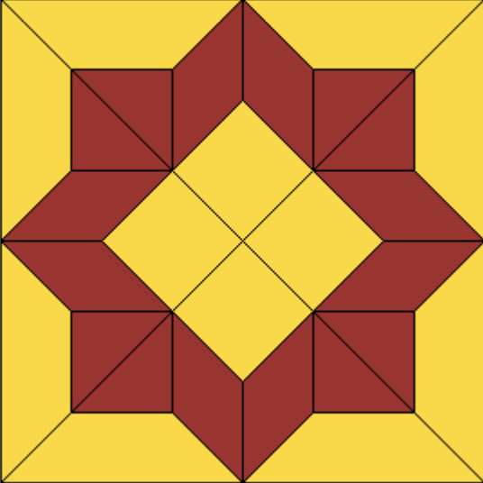

# Lekcja 9 – Zastosowanie praktyczne – sterowanie „robotem” za pomocą modułu turtle

**Czas realizacji:** 90 minut (2 godziny lekcyjne). Podany czas jest przybliżony i należy dostosować go do potrzeb oraz tempa pracy klasy.
{: .lesson-duration }

## Wymagana wiedza

- Podstawy składni języka Python: zmienne oraz pętle for i while.
- Rozumienie sposobu sterowania robotem za pomocą prostych poleceń (z lekcji 1).
- Podstawy geometrii (rozumienie kątów w figurach płaskich).

## Treści z podstawy programowej

*Wybrane wymagania z podstawy programowej dla klas VII–VIII. [Źródło](https://zpe.gov.pl/podstawa-programowa/szkola-podstawowa/informatyka).*

| Dział | Sekcja |
| --- | --- |
| II. Programowanie i rozwiązywanie problemów z wykorzystaniem komputera i innych urządzeń cyfrowych. Uczeń: | |
| | 1) projektuje, tworzy i testuje programy w procesie rozwiązywania problemów. W programach stosuje: instrukcje wejścia / wyjścia, wyrażenia arytmetyczne i logiczne, instrukcje warunkowe, instrukcje iteracyjne, funkcje oraz zmienne i tablice. W szczególności programuje algorytmy z działu I pkt 2; |
| | 2) steruje robotem lub innym obiektem na ekranie; |
| I. Rozumienie, analizowanie i rozwiązywanie problemów. Uczeń: | |
| | 1) formułuje problem w postaci specyfikacji (czyli opisuje dane i wyniki) oraz wyróżnia kroki w algorytmicznym rozwiązywaniu problemów. […] |
| IV. Rozwijanie kompetencji społecznych. Uczeń: | |
| | 1) bierze udział w różnych formach współpracy, jak: […] realizacja projektów, […] projektuje, tworzy i prezentuje efekty wspólnej pracy; |

## Wstęp teoretyczny (przewidziany na około 10 minut)

Na pierwszej lekcji bawiliśmy się w sterowanie „wirtualnym robotem” na kartce papieru. Dziś ten robot ożyje na ekranie dzięki modułowi `turtle` (po angielsku: żółw). Jest to wbudowany moduł Pythona do tworzenia grafiki żółwia, pozwalający rysować kształty za pomocą prostych poleceń.

Żółw to obiekt, który posiada „ogon” działający jak pisak – kiedy się porusza, zostawia ślad na ekranie. Takie podejście uczy nas, że programowanie to cały proces: od specyfikacji problemu (co chcemy narysować), przez opracowanie rozwiązania, aż po testowanie i poprawianie błędów w kodzie.

### Informatyka „unplugged” – powtórka ze sterowania robotem (5 minut)

Przypomnijmy sobie zadanie z kwadratem z lekcji 1. Gdybyś miał zapisać instrukcję narysowania trójkąta równobocznego, o jaki kąt musiałby obrócić się robot, aby po narysowaniu boku „zakręcić” do następnego?

Wskazówka: Robot musi obrócić się o kąt zewnętrzny figury. Dla kwadratu było to 90 stopni. Dla trójkąta będzie to 120 stopni.

## Wspólne eksperymenty z modułem turtle (20 minut)

Aby zacząć, musimy zaimportować moduł i stworzyć naszego „robota”:

```python
from turtle import *

zolw = Turtle()  # Tworzymy naszego żółwia
zolw.shape("turtle")    # Zmieniamy kształt kursora na żółwia

zolw.forward(100)       # Idź naprzód o 100 kroków
zolw.right(90)          # Obróć się w prawo o 90 stopni
zolw.color("blue")      # Zmień kolor pisaka
zolw.circle(50)    # Narysuj okrąg
done()            # Pozostaw okno otwarte
```

## Zadania do rozwiązania na komputerze (przewidziane na około 60 minut)

Podczas pracy nad zadaniami projektuj, twórz i testuj swoje programy, dbając o ich czytelność.

1. Kwadrat: Napisz program, który narysuje kwadrat o boku 150. Wykorzystaj pętlę `for i in range(4)`, aby uniknąć powtarzania tych samych komend.
2. Trójkąt: Napisz program, który narysuje trójkąt równoboczny o boku 150.
3. Wielokąt: Napisz funkcję `rysuj_wielokat(n, bok)`, która narysuje wielokąt foremny o `n` bokach (n ≥ 3). Pamiętaj, że kąt obrotu to zawsze `360 / n`.
4. Kolorowa gwiazda: Narysuj gwiazdę pięcioramienną (kąt obrotu 144 stopni). Niech każde ramię ma inny kolor.
5. Zadanie z konkursu miniLOGIA 16: Napisz funkcję `posadzka(n)`, która po wywołaniu narysuje kafelek posadzki o boku `n` i kształcie przedstawionym na rysunku poniżej:


